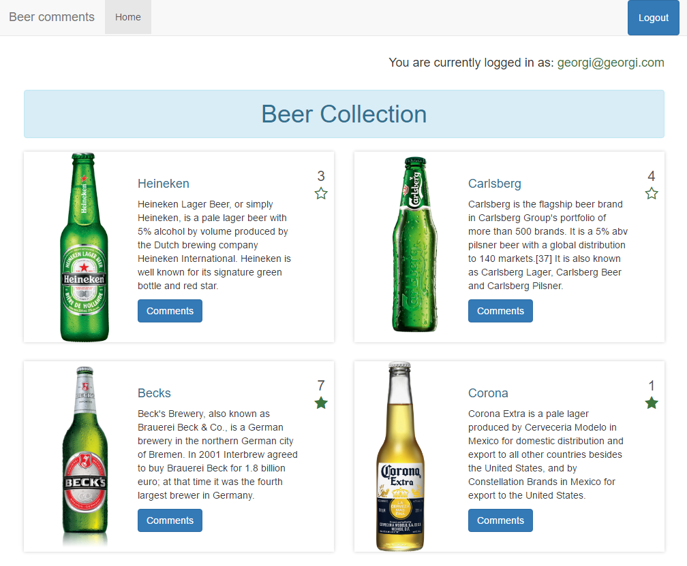

# Beer Rating

Developed for a PHP and jQuery course in Metropolia's summer ICT school, Beer Rating is a PHP app to allow you to create an account and comment on different beers.

You can express your love for a brand by starring it and therefor incrementing the score for that particular beer.

## Social Links

- [georgiyanev.me](https://georgiyanev.me)
- [Facebook](https://www.facebook.com/jumpalottahigh/)
- [Twitter](https://www.twitter.com/jumpalottahigh/)
- [LinkedIn](https://www.linkedin.com/in/yanevgeorgi/)
